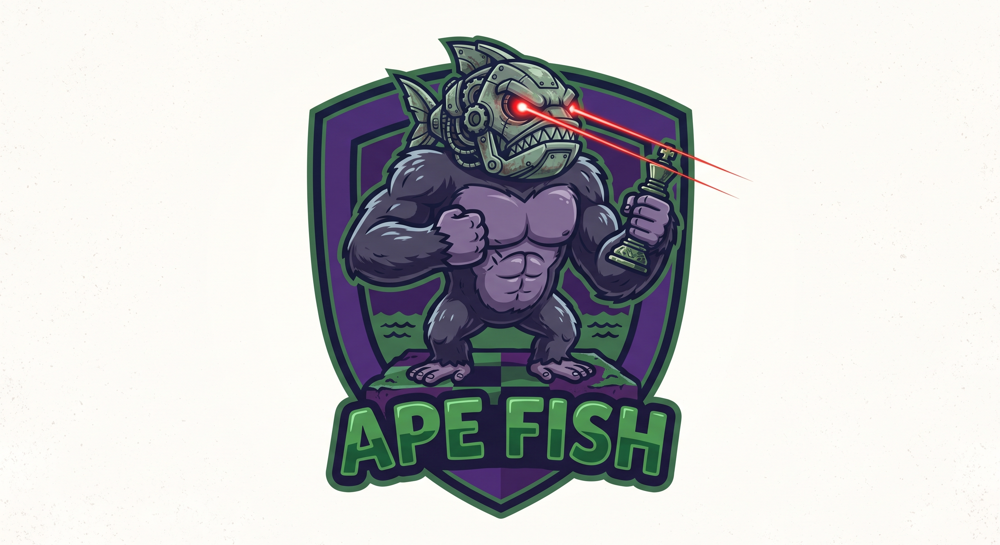

<p align="center">
  
</p>

NOTE: This repo is not ready for use yet. This readme is just an AI generated file, I will hand write and make clearer once it is ready for use.

The core of the engine is nearly all hand written, the UCI client, docs, tests, are nearly all AI generated for now, and need some cleanup before I'd put my name behind it.

# apefish

A chess engine, written in Rust as a Cargo workspace:

- `engine/` (`apefish-engine`) - the engine itself: board representation, move
  generation, search, eval, exposed through the `Engine` trait.
- `cli/` (`apefish-cli`) - a terminal front-end for playing against the engine
  locally, plus a [UCI](https://www.chessprogramming.org/UCI) adapter for use
  with UCI-compatible GUIs and tools.

## Build

```sh
cargo build              # whole workspace, debug
cargo build --release    # whole workspace, optimized - use this for anything
                          # performance-sensitive (perft, benchmarks, real games)
cargo build -p apefish-engine   # just the engine
```

## Test

```sh
cargo nextest run               # all test in parallel
cargo test                      # whole workspace, each suite 1 at a time
cargo test -p apefish-engine    # just the engine's tests
```

The engine's test suite (`engine/tests/perft.rs`) checks move generation
correctness via [perft](https://www.chessprogramming.org/Perft) against
known-good node counts from two independently verified sources: the
chessprogramming.org "Perft Results" position set and Martin Sedlak's
targeted move generator test positions. Run in `--release` these still
finish in well under a second; in debug they're significantly slower but
still fine for routine use.

On a node-count mismatch, the failing test auto-bisects against a local
Stockfish binary to isolate the exact node and move that diverges, printing
the trace as part of the test output. This needs `stockfish` on `PATH` (or
`STOCKFISH_BIN=/path/to/it` set); if it's not found, bisection is skipped
with a note and the test just fails on the count as normal.

For ad-hoc bisection outside the test suite (e.g. a position/depth that
isn't one of the existing cases), use the standalone example:

```sh
cargo run --release -p apefish-engine --example perft_divide -- <depth> "<fen>" [uci_move ...]
```

## Benchmark

```sh
cargo bench -p apefish-engine --bench perft_bench
```

Measures move generation throughput (nodes/sec) via perft over the same
well-known positions the correctness tests use, reported by
[Criterion](https://bheisler.github.io/criterion.rs/book/) as "thrpt"
(elements/sec = nodes/sec). This is about *speed*, not correctness - node
counts aren't asserted here, only used to compute throughput.

To check whether an engine change made move generation faster or slower,
save a baseline before the change and compare against it after:

```sh
cargo bench -p apefish-engine --bench perft_bench -- --save-baseline before
# ... make your change ...
cargo bench -p apefish-engine --bench perft_bench -- --baseline before
```

The second run prints a regressed/improved percentage per position instead
of just an absolute number. `target/criterion/report/index.html` has the
full report with plots.

## Run

```sh
cargo run -p apefish-cli
```

Starts the terminal front-end for playing against the engine locally. This
is still early/hardcoded (see `cli/src/main.rs`) - other front-ends are
expected to follow, driving the same `Engine` trait.

### UCI mode

```sh
cargo build --release -p apefish-cli
./target/release/apefish --uci
```

Speaks the [UCI protocol](https://www.chessprogramming.org/UCI) over
stdin/stdout (see `cli/src/uci.rs`), so any UCI-compatible GUI or tool can
drive it by being pointed at the built `apefish` binary above. Point tools
at the binary directly rather than via `cargo run` - most of them invoke the
engine as a subprocess and don't go through Cargo.

Note: `go`'s search is currently a stub that returns the first legal move
instantly - the protocol itself is fully wired up ahead of real search
landing in `apefish-engine`, so games played this way won't be meaningful
yet, but the UCI handshake and move application can already be exercised
end-to-end.

`run_apefish_uci.sh` (repo root) wraps the two lines above into one command
- `./run_apefish_uci.sh` - for tools that just need something to launch
without having to remember to build `--release` or pass `--uci` themselves.
It resolves paths relative to its own location, so it can be invoked from
anywhere. Build the release binary before using it (see above); it doesn't
build it for you.

### Testing with cutechess-cli

[cutechess-cli](https://github.com/cutechess/cutechess) runs UCI engines
against each other from the command line, useful for sanity-checking the
UCI adapter or running test matches. Install it (package manager, or build
from source), then:

```sh
cutechess-cli \
  -engine cmd=./run_apefish_uci.sh name=apefish \
  -engine cmd=./run_apefish_uci.sh name=apefish-2 \
  -each proto=uci tc=40/60 \
  -rounds 1
```

This plays apefish against a second copy of itself. Swap the second
`-engine` line for another UCI engine's binary to test against something
else instead, e.g. Stockfish:

```sh
cutechess-cli \
  -engine cmd=./run_apefish_uci.sh name=apefish \
  -engine cmd=stockfish name=stockfish \
  -each proto=uci tc=40/60 \
  -rounds 1
```

### Playing against a human with Cute Chess

[Cute Chess](https://cutechess.com/) is the GUI counterpart to
`cutechess-cli`, for playing interactive games rather than running
automated matches:

1. `cargo build --release -p apefish-cli`
2. In Cute Chess: Tools → Settings → Engines → Add, then point it at
   `run_apefish_uci.sh` (repo root) with protocol "UCI" (name it e.g.
   `apefish`). The wrapper script already passes `--uci` for you, so unlike
   pointing Cute Chess straight at the `apefish` binary, no Arguments need
   to be set.
3. Game → New Game, set one side to "Human" and the other to the `apefish`
   engine, then play.

## Play on Lichess

[`docker/`](docker/) packages apefish together with
[lichess-bot](https://github.com/lichess-bot-devs/lichess-bot) into a single
OCI container, so the engine can accept and play challenges on
[Lichess](https://lichess.org/) as a BOT account. The image is Python +
lichess-bot + a statically linked (`x86_64-unknown-linux-musl`) apefish
binary; `config.yml` is bind-mounted at runtime so it can be edited without
rebuilding. [`docker/README.md`](docker/README.md) has the full runbook;
the short version:

### Prerequisites

- `podman` (preferred, daemonless) or `docker`
- `rustup` - `docker/build.sh` adds the `x86_64-unknown-linux-musl` target if
  missing. If the musl link step fails: `sudo apt install musl-tools`.
- A separate Lichess account for the bot, with **zero games played**, and an
  OAuth token for it with the `bot:play` scope
  (<https://lichess.org/account/oauth/token>).

### One-time setup

1. Save the token where the container will read it:

   ```sh
   mkdir -p ~/.config/apefish-bot
   printf 'LICHESS_BOT_TOKEN=lip_xxxxxxxxxxxx\n' > ~/.config/apefish-bot/lichess.env
   chmod 600 ~/.config/apefish-bot/lichess.env
   ```

2. In [`docker/config.yml`](docker/config.yml) set `challenge.allow_list` to
   your main Lichess username (so only you can challenge the bot), or delete
   that block to accept challenges from anyone.

3. Build the image (compiles the engine on the host, then builds the image):

   ```sh
   docker/build.sh
   ```

4. Upgrade the bot account to a BOT account (irreversible):

   ```sh
   podman run --rm \
     --env-file ~/.config/apefish-bot/lichess.env \
     -v ~/projects/apefish/docker/config.yml:/lichess-bot/config.yml:ro \
     apefish-bot:latest -u
   ```

### Run

```sh
podman run -d --name apefish-bot \
  --env-file ~/.config/apefish-bot/lichess.env \
  -v ~/projects/apefish/docker/config.yml:/lichess-bot/config.yml:ro \
  apefish-bot:latest

podman logs -f apefish-bot          # watch it connect and wait for challenges
podman stop apefish-bot && podman rm apefish-bot
```

Then challenge it from your main account: open the bot's Lichess profile and
click Challenge, or go to `lichess.org/?user=<botname>#friend`. lichess-bot
auto-accepts challenges that match `config.yml` (standard, bullet/blitz/rapid,
casual or rated).

For an always-on setup that auto-restarts and survives reboots, install the
Podman Quadlet unit [`docker/apefish-bot.container`](docker/apefish-bot.container)
as a rootless user service - see [`docker/README.md`](docker/README.md), which
also covers what to check when the bot doesn't come online.

### Tuning

- Games lost on time: raise `move_overhead` in `config.yml` (default `2000`
  ms), restart the container. Start at blitz/rapid before enabling bullet.
- Change accepted time controls: edit `challenge.time_controls`, restart.
- Transposition table size: `engine.uci_options.Hash` (MiB), restart.
